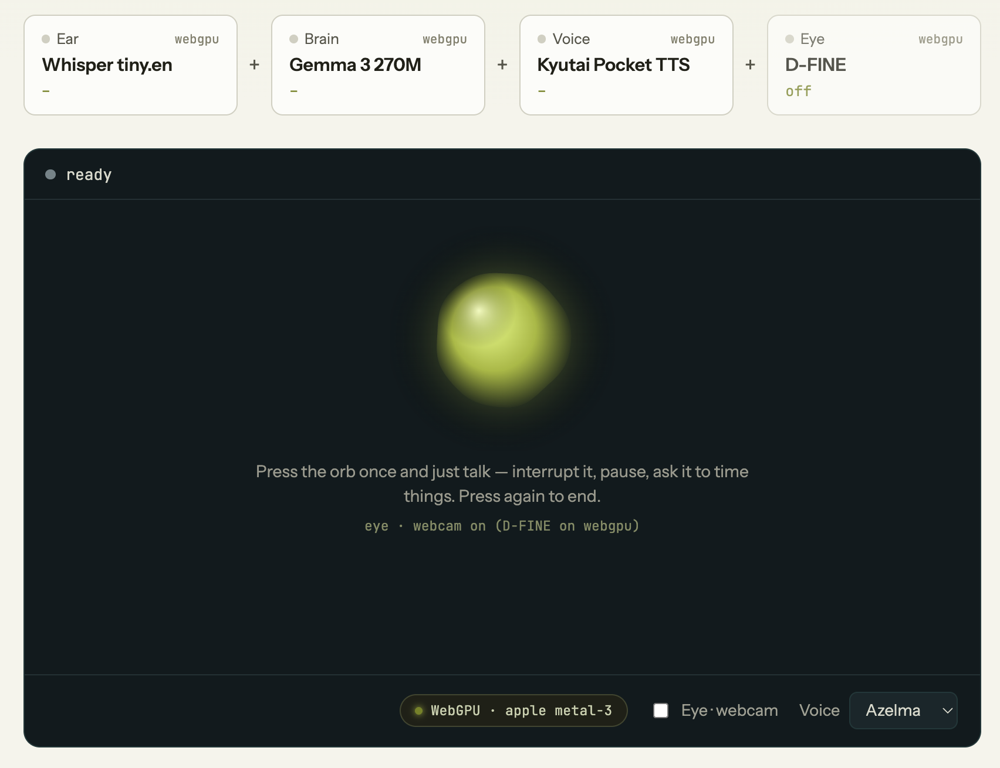

# jax-realtime

A real-time, full-duplex voice assistant that runs **entirely in your browser**
on WebGPU, built with [jax-js](https://github.com/ekzhang/jax-js).

Every stage — speech → ASR → LLM → TTS → speech, plus optional vision — runs
locally in the tab; nothing is sent to a server.



It's inspired by the Thinking Machines
[interaction model](https://thinkingmachines.ai/blog/interaction-models/) and
[GPT-Live](https://openai.com/index/introducing-gpt-live/): the goal is a
conversation that *feels* live — you can interrupt it mid-sentence, pause to
think, and it backchannels while you talk — reproduced as a small-model cascade
that fits in a browser.

| Stage | Model | Runs on |
| --- | --- | --- |
| Ear (ASR) | Whisper base.en (fp16) | WebGPU via jax-js |
| Brain (LLM) | Gemma 3 270M instruction-tuned (fp16) | WebGPU via jax-js |
| Voice (TTS) | Kyutai Pocket TTS + Mimi codec (fp16) | WebGPU via jax-js |
| Eye (vision) | D-FINE small (COCO-80) | WebGPU via `@jax-js/onnx` |

Everything shares the single WebGPU device. The streaming ASR lane is paused
while the assistant speaks so it doesn't contend with TTS for the GPU; barge-in
is therefore energy-based (see below), and captions resume the moment the
assistant stops.

## Interaction

- **Full-duplex micro-turns** — a ~150 ms tick loop drives a deterministic,
  priority-ordered policy: adaptive **barge-in** (talk over the assistant and
  its audio cuts in ~300 ms; the threshold auto-calibrates to the echo floor of
  each reply), mid-utterance **backchannels**, adaptive **endpointing**, and
  time-awareness timers. A watchdog force-recovers the session if a reply ever
  stalls, so it can't wedge.
- **Phantom-turn guard** — near-silence and ambient swells are rejected from the
  captured PCM (voiced-duration + peak, over an adaptive noise floor) before
  they reach Whisper, and a repetition-degeneracy gate drops decoder loops — so
  the assistant doesn't answer "thank you"s you never said. Snappy one-word
  replies ("what?", "no") still get through.
- **Eye (vision)** — on by default; the webcam is already detecting on the
  standby screen, before you press the orb. D-FINE runs low-priority object
  detection (it yields the GPU to audio), smooths the person count, and grounds
  "what do you see?" / "how many people?" from the measurements. Proactive
  interjections (stepped away, phone spotted, slouching) are best-effort rule
  heuristics. The webcam shows as a corner PiP with detection boxes.
- **Two-tier tools** — factual asks are delegated so the 270M model isn't left
  guessing: weather ("what's the weather in Tokyo" → [open-meteo](https://open-meteo.com/),
  in °F/mph), facts ("who is Ada Lovelace" → Wikipedia), plus instant offline
  **calculator** and **clock/date**. Web lookups speak a holding line and fetch
  in the background, then answer on the next silence and render a card; the
  card clears when the conversation moves on.

## Performance (all on jax-js / WebGPU)

The turn-latency floor is set by the single GPU, so the work went into cutting
GPU cost per token/frame rather than overlapping stages (which a single device
can't do — see `docs/BENCHMARKS.md` for the full map-reduce campaign log,
including the negative results):

- **Fused decode** — the Gemma decode step is fused from ~21 per-layer jit
  dispatches into one, and Pocket TTS from ~11 into two, cutting the
  command-buffer submit overhead that dominated per-step cost (~22% each).
- **GPU top-k sampling** — the LLM samples from a device-side top-64 (one small
  readback) instead of transferring the full 262k-vocab logits every token,
  folded into the fused step's single dispatch.
- **Smaller download** — Gemma's tied embedding table (the single biggest
  tensor) is shipped int8 and dequantized to fp16 at load, and the three model
  weights fetch in parallel.

Runtime behaviour is tunable at `src/tunables.ts` (read live, so the in-browser
bench can A/B without a rebuild).

## Run it

```sh
npm install
npm run dev
```

Open http://localhost:5173 in a WebGPU-capable browser (Chrome/Edge on desktop,
Safari 26+). Click **Load models** (~680 MB on first run, cached in OPFS
afterwards), grant camera access for the Eye, then press the orb once and just
talk — hands-free: turn ends are detected by silence, your words stream into the
transcript live, the assistant answers out loud and resumes listening. Press the
orb again to end.

> The Gemma download prefers a locally-hosted int8-embedding build at
> `public/weights/gemma-it-q8e.safetensors` (gitignored; regenerate with
> `scratchpad`-style quantization or host it yourself). Without it, the loader
> automatically falls back to the fp16 file on Hugging Face.

The orb reacts in real time: it breathes when idle, swells with your voice while
listening, shimmers while the model thinks, and pulses with the synthesized
speech while answering. Per-stage latencies and the active GPU are shown in the
pipeline rail and footer.

## How it works

- `src/asr/` — Whisper encoder/decoder, log-mel features, greedy timestamp
  decoding; `streaming.ts` is the LocalAgreement-2 streaming transcriber
  (committed + tentative text, self-echo filter, `bestText()` for the
  low-latency turn end).
- `src/llm/gemma.ts` — Gemma 3 forward pass with KV cache, plus the fused
  single-dispatch decode step and int8-embedding dequant-on-load.
- `src/tts/` — Pocket TTS flow-matching LM + Mimi streaming decoder (with the
  fused per-frame decode) and a streaming `AudioContext` player.
- `src/pipeline.ts` — loads weights from Hugging Face (cached via OPFS),
  orchestrates the stages, and holds the model/sampler perf paths.
- `src/duplex.ts` — the full-duplex micro-turn engine (barge-in, phantom guard,
  backchannels, endpointing, timers, vision interjections, two-tier tools,
  session watchdog).
- `src/vision/` — D-FINE detector on `@jax-js/onnx`, webcam VisionSession, COCO
  labels, box-dedupe and person-count smoothing.
- `src/tools/tools.ts` — keyless intent detection + weather / Wikipedia / calc /
  clock.
- `src/mic.ts` — 16 kHz PCM capture via AudioWorklet. `src/orb.ts` — the
  audio-reactive orb. `src/main.ts` — UI and wiring.

## License

[MIT](LICENSE). Model inference code is adapted from the
[jax-js repository](https://github.com/ekzhang/jax-js/tree/main/website/src/routes)
by Eric Zhang (MIT licensed); model weights remain under their respective
licenses.
