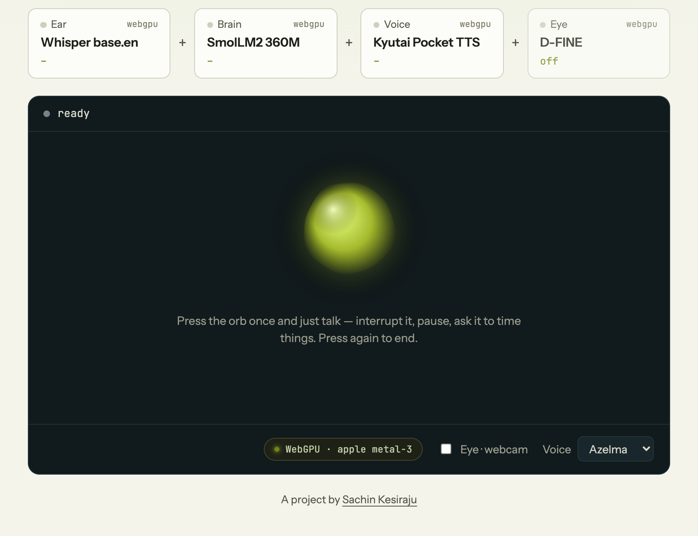

# jax-realtime

A real-time, full-duplex voice assistant that runs **entirely in your browser**
on WebGPU, built with [jax-js](https://github.com/ekzhang/jax-js).

Every stage — speech → ASR → LLM → TTS → speech, plus optional vision — runs
locally in the tab; nothing is sent to a server.



It's inspired by the Thinking Machines
[interaction model](https://thinkingmachines.ai/blog/interaction-models/) and
[GPT-Live](https://openai.com/index/introducing-gpt-live/), rebuilt as a
small-model cascade that fits in a browser tab. The goal is a conversation
that *feels* live: you can interrupt it mid-sentence, pause mid-thought
without losing your turn, and it keeps searching in the background while you
talk.

| Stage | Model | Runs on |
| --- | --- | --- |
| Ear (ASR) | Whisper base.en (int8, dequantized to fp16) | WebGPU via jax-js |
| Turn-taking (VAD) | Silero VAD v5, ported to TypeScript | CPU (~2 ms / 32 ms frame) |
| Brain (LLM) | SmolLM2-360M-Instruct (fp16) | WebGPU via jax-js |
| Voice (TTS) | Kyutai Pocket TTS + Mimi codec (fp16) | WebGPU via jax-js |
| Eye (vision) | D-FINE small (COCO-80) | WebGPU via `@jax-js/onnx` |

Everything shares the single WebGPU device. The streaming ASR lane is paused
while the assistant speaks so it doesn't contend with TTS for the GPU; barge-in
is therefore energy-based (see below), and captions resume the moment the
assistant stops.

## Interaction

- **Full-duplex micro-turns** — a ~150 ms tick loop drives a deterministic,
  priority-ordered policy: adaptive **barge-in** (talk over the assistant —
  including its tool narrations — and the audio cuts in ~300 ms; the threshold
  auto-calibrates to the echo floor of each reply), adaptive **endpointing**,
  and time-awareness timers. A watchdog force-recovers the session if a reply
  ever stalls, so it can't wedge.
- **Continuation-merge** — if the endpoint fires on a mid-thought pause and you
  resume speaking before the reply's first audio, the unheard reply is aborted
  and both halves are answered as one turn ("append, don't restart").
- **Learned turn signal** — a pure-TypeScript port of Silero VAD v5 scores
  P(speech) every 32 ms on the CPU and drives speech onset, silence tracking,
  and the phantom-turn guard: keyboard noise and ambient swells never even
  latch an utterance, near-silence never reaches Whisper (so no hallucinated
  "thank you"s), and quiet speech still passes. A repetition-degeneracy gate
  drops decoder loops on top.
- **Eye (vision)** — enabled by default for webcam context, with a pre-load
  toggle to skip its 42 MB model, camera access, and GPU residency. D-FINE
  runs low-priority object detection (it yields the GPU to audio), smooths the
  person count, and answers
  "what do you see?" / "how many people?" / "tell me about the person"
  directly from the measurements. Proactive interjections (stepped away,
  phone spotted, slouching) are best-effort rule heuristics. The webcam shows
  as a corner PiP with detection boxes.
- **Typed conversation memory** — bounded facts the user explicitly states
  (name, trip, pet, favorite, plans, relationships) are retained and injected
  only when relevant; exact recall bypasses small-model guessing.
- **Two-tier tools** — factual asks are delegated so the small on-device model
  isn't left guessing: weather ("what's the weather in Tokyo" → [open-meteo](https://open-meteo.com/),
  in °F/mph), facts ("who is Ada Lovelace" → Wikipedia), plus instant offline
  **calculator** and **clock/date**. Web lookups speak a holding line and fetch
  in the background, then answer on the next silence and render a card; the
  card clears when the conversation moves on, and the spoken answer can be
  interrupted like any reply.

## Performance (all on jax-js / WebGPU)

The turn-latency floor is set by the single GPU, so the work went into cutting
GPU cost per token/frame rather than overlapping stages (which a single device
can't do — see [`docs/BENCHMARKS.md`](docs/BENCHMARKS.md) for the full
map-reduce campaign log, including the negative results):

- **Fused decode** — the LLM decode step is fused from dozens of per-layer jit
  dispatches into one, and Pocket TTS from ~11 into two, cutting the
  command-buffer submit overhead that dominated per-step cost (~22% each).
- **GPU top-k sampling** — the LLM samples from a device-side top-64 (one small
  readback) instead of transferring the full vocab logits every token,
  folded into the fused step's single dispatch.
- **Stable prefill shapes** — every turn has a different prompt length, which
  otherwise forces jax-js to compile new traces mid-conversation. Prompts use
  256-token buckets, the common buckets are warmed during loading, and the KV
  cache has one fixed capacity — so long conversations never hit a
  multi-second recompile stall mid-turn.
- **Faster confidence-aware ASR** — timestamp-gate candidate reductions are
  reused for confidence scoring instead of scanning the vocabulary again. ASR
  runs 5–7% faster while preserving all 21 paired clean/quiet/distorted
  transcripts; low-confidence failures request a repeat before invoking the LLM.
- **Bounded history window** — the prompt is capped at 8 messages so it never
  leaves the warm prefill buckets: first-token latency stays flat (~500–610 ms)
  across long sessions instead of doubling around turn 6, and the worst turn of
  a 12-turn session sits within ~150 ms of the median.
- **Deterministic memory fast paths** — exact recall and bounded trip, pet, and
  activity follow-ups can answer in a few milliseconds without model generation.
- **Smaller download** — Whisper ships a per-row int8 build (73 MB instead of
  144 MB), while the TTS checkpoint omits 35 MB of audio-encoder weights never
  used for synthesis. The SmolLM2 brain stays full fp16 for conversation quality.

Runtime behaviour is tunable at `src/tunables.ts` (read live, so A/B
experiments don't need a rebuild).

## Hard-won details

Things a default implementation gets wrong, found in live sessions and fixed
here (full stories in [`docs/BENCHMARKS.md`](docs/BENCHMARKS.md)):

- **The assistant used to interrupt itself.** The barge-in threshold
  calibrated its echo floor during the reply's first ticks — which fall in the
  silent LLM/TTS latency gap, so the floor was ambient-level and the
  assistant's own playback echo tripped it. Calibration now only counts ticks
  where the TTS output analyser confirms audio is actually playing.
- **Whisper invents "Thank you." from silence.** Every Whisper size does this
  (silent-outro captions in its training data), and it decodes with *high*
  confidence, so no model swap or confidence gate catches it. The fix is
  signal-side: unvoiced audio never reaches the decoder, on every endpoint
  path — including barge-in continuations, which originally skipped the guard.
- **A mid-sentence TTS cut sounds like a full stop.** Each chunk is
  synthesized as a complete utterance, so flushing at a bare word boundary
  produces sentence-final falling intonation plus a pause in the middle of
  your sentence. Chunks now only split at real punctuation — a measured
  latency cost, paid for prosody.
- **Merges must be bounded.** Letting speech-resumption merge with the fired
  turn across the whole pre-audio gap meant any breath or chair creak aborted
  the pending reply — and merges could chain, so answers arrived seconds late
  to a mangled question. Now: one merge per turn, inside a 700 ms window.
- **First-token latency doubled at turn 6 — deterministically.** With no KV
  reuse the whole prompt re-prefills every turn, and history growth pushed the
  padded prompt across a jit-trace bucket boundary mid-session. Capping the
  window at 8 messages keeps every turn in the warm buckets.
- **Silero VAD without onnxruntime.** The 16 kHz branch is ~200k params, so
  it's ported to plain TypeScript (the LSTM cell is two matmuls and four
  gates) and parity-checked against the reference to 1e-6. Two contract traps:
  the ONNX's *else*-branch is the 8 kHz path, and the model needs the official
  wrapper's 64-sample rolling context — without it, clean speech scores ~0.16.
- **Geocoder backoff can invent cities.** "Look at the weather in San
  Francisco" once resolved to Teresina, Brazil: the place extractor grabbed
  the verb's preposition and the token backoff degenerated to geocoding
  "the", which open-meteo fuzzy-matches. The extractor now recurses to the
  innermost preposition and never geocodes bare function words.
- **Latency benches can't hear.** Two timing wins (an eager endpoint, an eager
  first TTS flush) passed every clip gate and failed immediately on a real
  microphone. Anything that changes turn-taking or audio structure ships only
  after a live listen; the clip suite guards regressions, not feel.

## Run it

```sh
npm install
npm run dev
```

Open http://localhost:5173 in a WebGPU-capable browser (Chrome/Edge on desktop,
Safari 26+). Click **Load models** (~1.0 GB on first run — SmolLM 724 +
Pocket TTS 201 + Whisper 73 + D-FINE 42, all cached in OPFS afterwards). The
Eye is enabled by default and requests camera access; uncheck it before loading
to skip D-FINE. Then press the orb once and just talk — hands-free: turn ends are
detected by silence, your words stream into the transcript live, the assistant
answers out loud and resumes listening. Press the orb again to end.

> **Smaller model downloads.** By default the app fetches the full fp16
> SmolLM2-360M weights from
> [Hugging Face](https://huggingface.co/sachink98/jax-realtime-weights); the
> Whisper base.en weights are still fetched as a per-row int8 build and
> dequantized to fp16 during load. The int8 Whisper transcribes the entire
> bench suite identically to fp16; the SmolLM2 brain is kept at full precision
> for the best conversation quality.

The orb reacts in real time: it breathes when idle, swells with your voice while
listening, shimmers while the model thinks, and pulses with the synthesized
speech while answering. Per-stage latencies and the active GPU are shown in the
pipeline rail and footer.

## How it works

The pipeline stages, from microphone to speaker:

| Path | What's there |
| --- | --- |
| `src/mic.ts` | 16 kHz PCM capture via an AudioWorklet. |
| `src/asr/` | Whisper encoder/decoder, log-mel features, greedy timestamp decoding. `streaming.ts` transcribes live using LocalAgreement-2: it locks in words once two passes agree, filters out the assistant's own voice, and exposes a best-guess transcript the moment your turn ends. `vad.ts` is the Silero VAD v5 port (STFT-as-conv, four conv layers, one LSTM cell — parity-checked against the onnxruntime reference). |
| `src/llm/smollm.ts` | SmolLM2-360M (Llama architecture) forward pass with a KV cache — the brain. Each token is generated in a single fused GPU dispatch, and the prompt prefill is bucket-padded so jit traces are reused across turns. Chosen via a blind-judged model shootout against same-size and larger alternatives. |
| `src/memory.ts` | Bounded extraction, relevance filtering, and deterministic recall for facts the user explicitly shared. |
| `src/tts/` | Pocket TTS flow-matching LM + Kyutai's [Mimi](https://github.com/kyutai-labs/moshi) streaming neural codec (reimplemented on jax-js, with the fused per-frame decode) and a streaming `AudioContext` player. `src/sentence-split.ts` chunks the LLM delta stream at clause boundaries for synthesis. |
| `src/vision/` | D-FINE detector on `@jax-js/onnx`, webcam `VisionSession`, COCO labels, box-dedupe and person-count smoothing. |
| `src/tools/tools.ts` | Keyless intent detection → weather / Wikipedia / calc / clock. |

## License

[MIT](LICENSE). Model inference code is adapted from the
[jax-js repository](https://github.com/ekzhang/jax-js/tree/main/website/src/routes)
by Eric Zhang (MIT licensed); model weights remain under their respective
licenses.
